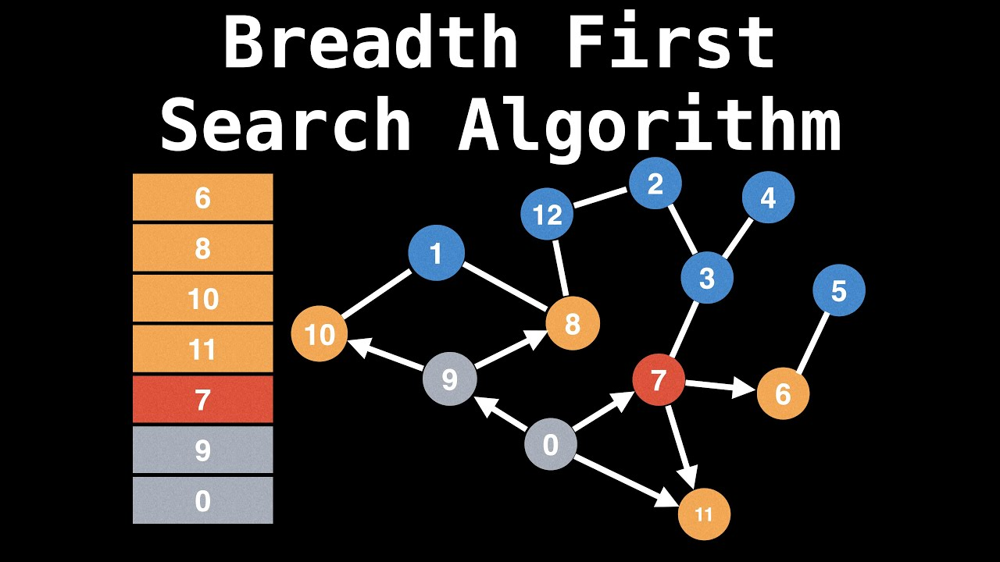
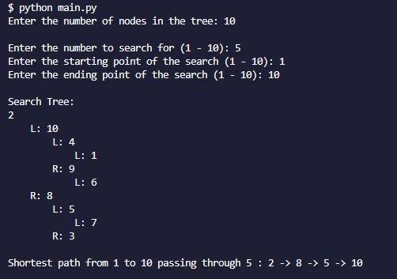

# Breadth-First Search Algorithm Program

           
   

### Table of Contents

- [Description](#description)
- [Key Features](#key-features)
- [How It Works](#how-it-works)
- [Use Cases](#use-cases)
- [Developed Using](#developed-using)
- [Getting Started](#getting-started)

### Description

This Python program implements a binary search tree with a breadth-first search algorithm to find the shortest path between two nodes. Users can specify the number of nodes in the tree, the number to search for, and the starting and ending points of the search. The program generates a random tree based on the user's input, and each time the program restarts, the location of the specified node is randomly determined. It then finds the shortest path from the starting point to the ending point while passing through the specified number.

### Key Features

- `Customizable Tree Size`: Users can input the number of nodes they want in the binary search tree, allowing for flexibility in testing different scenarios.

- `Breadth-First Search (BFS)`: The program employs the BFS algorithm to efficiently find the shortest path between two nodes in the binary search tree.

- `Search Functionality`: Users can specify the number they wish to search for within the tree, as well as define the starting and ending points for the search.

### How It Works

- `Building the Tree`: The program generates a random binary search tree based on the user-provided size. Each node in the tree is assigned a unique value.

- `Searching for the Shortest Path`: Using the BFS algorithm, the program finds the shortest path from the starting point to the ending point in the tree while passing through the designated intermediate node.

- `Output`: The program displays the generated binary search tree and the shortest path found, providing users with insights into the structure of the tree and the path traversal.

### Use Cases:

- `Educational Purposes`: Students and educators can utilize this program to understand and visualize the concepts of binary search trees and BFS algorithms.

- `Algorithm Testing`: Researchers and developers can test the efficiency and effectiveness of BFS in finding shortest paths in various scenarios.

- `Problem-Solving Practice`: Enthusiasts and practitioners can use this program as a tool for honing their problem-solving skills by experimenting with different tree configurations and search parameters.

### Developed Using:

The `deque` class in Python is part of the collections module. `"deque"` stands for `"double-ended queue"`, which is a data structure that allows efficient insertion and deletion operations at both ends of the sequence. It provides an alternative to Python's built-in list type, particularly when you need to efficiently append or pop elements from both ends of a sequence.

##### Here are some key features of deque:

- `Efficient Operations`: deque supports efficient append, appendleft, pop, and popleft operations, all of which take constant time, O(1), regardless of the size of the deque.

- `Memory Efficiency`: Unlike Python lists, which may require occasional resizing and memory reallocation, deques are optimized for fast appends and pops, with minimal memory overhead.

- `Thread Safety`: Deques are thread-safe, meaning they can be safely accessed from multiple threads without the need for explicit synchronization.

- `Versatility`: Deques can be used in a wide range of applications, including queue-like data structures, stack-like data structures, and algorithms like breadth-first search (BFS) and breadth-first traversal.

Overall, `deque` provides a flexible and efficient way to manage sequences of data in Python, especially when you need to perform frequent insertions and deletions at both ends of the sequence.

#### Getting Started

1. Clone the repository to your local machine:

   <pre><code>git clone https://github.com/jvang0620/Breadth-First-Search</code></pre>

2. Run the application:

   - Navigate to the directory where your Python file is located using the terminal or command prompt.

   - Run the following command to execute the program:

     `python main.py`

   - The program will prompt you to enter the number of nodes you want in the tree.

   - Next, it will ask you to input the value of the node you are searching for.

   - Afterward, you will be prompted to enter the starting and ending points of the search.

   - Finally, the program will display the generated search tree in the terminal and output the shortest path found.

   - An example of the program's output in the terminal is shown below:

   

           
   

Enjoy using the Breadth-First Search Algorithm Program!
